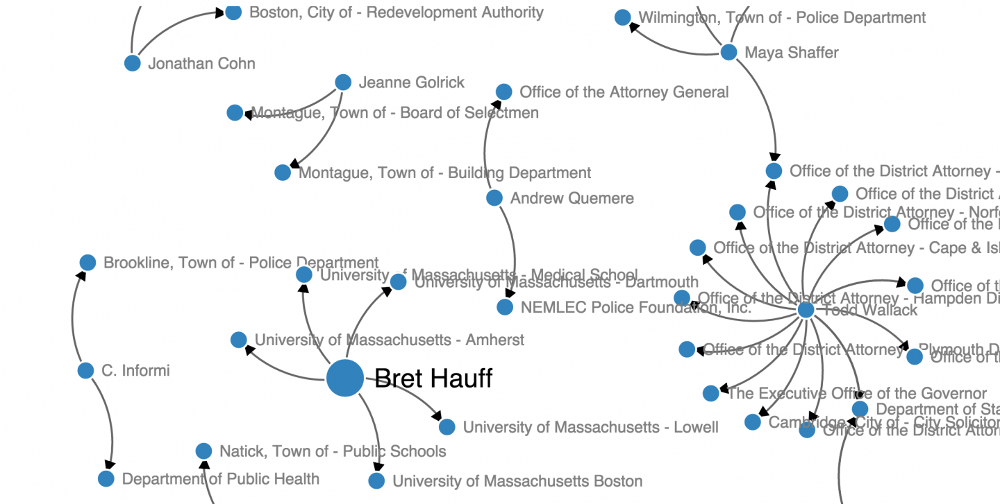

##Visualizing public records appeals in your state

How can visualization illuminate the labyrinthine world of public records requests and appeals? Here at Northeastern’s <a href="http://www.northeastern.edu/camd/journalism/academic-programs/ma-journalism-2/">Media Innovation program</a>, we've been using <a href="http://d3js.org" target="_blank">D3</a> to illustrate the persons and institutions in Massachusetts who have most frequently been involved in <a href="http://www.foia.gov/" target="_blank">Freedom of Information Act</a> (FOIA) request appeals over the past 20 months or so. (Scroll down for the visualization and open-sourced code.)

Every year, thousands of public records requests are made across Massachusetts. Many get an adequate response from towns, cities and state agencies. But some are greeted with silence, delay, or, in certain cases, direct challenges by government lawyers or assessments of extraordinarily high compliance fees.

Massachusetts has long had some of the <a href="https://www.bostonglobe.com/metro/2015/07/18/often-national-leader-massachusetts-ranks-near-bottom-government-transparency/HfjFvRd4RJI6QYIHBAobEP/story.html" target="_blank">weakest</a> public records laws in the country, to the chagrin of citizens, community groups and, of course, journalists. Recently, however, the state’s House of Representatives passed a bill that would <a href="https://www.bostonglobe.com/metro/2015/11/19/look-massachustts-public-records-bill/qyLViqugWddw4TU51B2mXK/story.html">nominally improve the situation</a>. That law’s fate remains uncertain, but we thought it was a good moment to look at how data visualization techniques might help explore FOIA issues and highlight the public stakes for public records rules.

Facing resistance, a select set of citizens, attorneys and journalists exercise their rights to try to enforce the law: They take their case to a higher level–to the Secretary of State’s Supervisor of Records, which reviews cases and, starting last year, <a href="http://www.sec.state.ma.us/AppealsWeb/AppealsStatus.aspx">posts the verdicts online</a>. (This process varies from state to state.) In Massachusetts, looking at FOIA appeals provides a real window into the mechanics, and the ground truth, of “open records.”

We wanted to look at <em>who</em> exactly shows this kind of extra determination and pursues requests in Massachusetts. In cases like this, after all, the law is only as strong as those advocating for it. For news organizations, visually exploring the patterns of requests can help highlight the constituencies for the law, which include all kinds of people: From those petitioning school boards over special needs cases to those trying to get more information about family in prison, from citizens in property disputes to persons trying to defend themselves legally by requesting arrest records. Please let us know if you use the code and build FOIA visualizations of your own!

<h2>Getting the data into a CSV</h2>
After digging into the data <a href="http://www.sec.state.ma.us/AppealsWeb/AppealsStatus.aspx" target="_blank">here</a>, we created a CSV with the top 10 most frequent appellants. The first row must be titled <em>source</em>, <em>target</em>, and <em>value</em>, all lowercase.

<h2>Building the network visualization in D3</h2>
Next, we put together some Javascript to build a <a href="https://en.wikipedia.org/wiki/Force-directed_graph_drawing" target="_blank">force-directed graph</a> visualization which uses simple math to lay out a dataset's nodes and boundaries in a balanced and even manner. We based our code mostly off of d3noob’s <a href="http://bl.ocks.org/d3noob/8043434" target="_blank">directional force layout diagram</a> but stripped a few lines of code out. We added some code (borrowed from <a href="http://bl.ocks.org/mbostock/3355967" target="_blank">here</a>) that allows the visualization to resize if the browser is resized.

&nbsp;

To view the visualization, <a href="http://storybench.org/d3plus/pubrec.html" target="_blank">click here</a>
